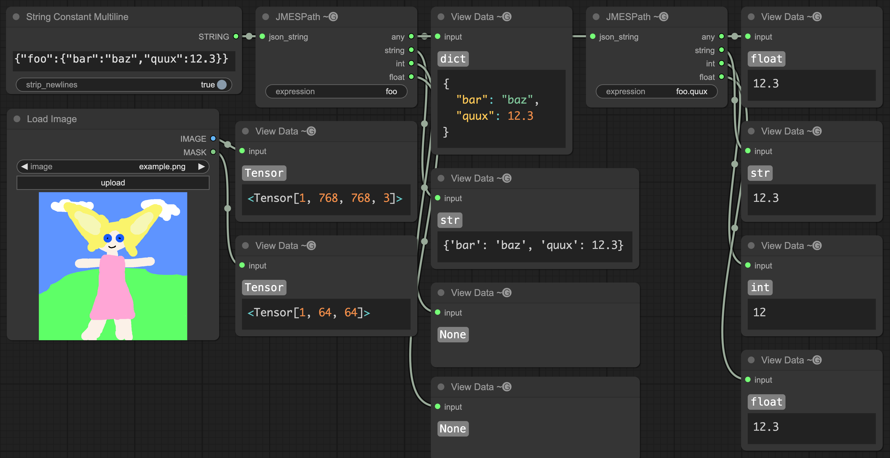

# ComfyUI-ViewData

A ComfyUI node that displays the type and contents of whatever is connected to the input.  In the case of a Tensor object, it shows the shape instead of its value.



## Installation

### ComfyUI-Manager

- Open the Manager
- Pick "Custom Nodes Manager"
- Search for "ComfyUI-ViewData"
- Install the latest version
- Restart ComfyUI

### Comfy-Cli

- Run `comfy node install comfyui-viewdata`
- Restart ComfyUI

### Manual

Run the following commands in the terminal:

```shell
cd custom_nodes
git clone https://github.com/Gremlation/ComfyUI-ViewData
```

Then restart ComfyUI.

## Options

You can change the indentation level for dictionaries by going to Settings > View Data ~🅖
